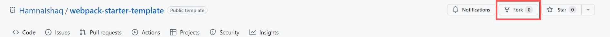
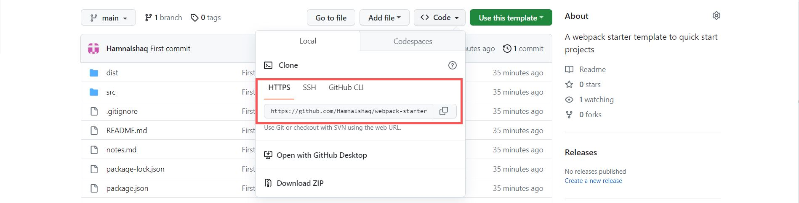

# webpack starter template

This is a simple webpack template to quick start your projects without the hassle of manually setting up webpack each time you start a new project.

# Get started

To get your own copy of this template, follow the steps below

1. Fork this repo



2. Make a new repository from this forked template


3. Clone this repository to your local environment



```sh
  git clone https://github.com/YOUR_GITHUB_NAME/webpack-starter-template.git
```

4. Install all node packages needed

```sh
  npm install
```

5. To set up a local dev server, use the command

```sh
  npm start
```

6. To bundle your js files, use the command

```sh
  npm run build
```

7. To host your completed project on Github pages, we would need to perform the following steps:

   - First go to the package.json file and find the repository key shown below:

     ```sh
       "repository": {
         "type": "git",
         "url": "git+https://github.com/{USERNAME}/{REPONAME}.git"
       }
     ```

   - Change the parameters `{USERNAME}` and `{REPONAME}` with your github username and repository name.

     Lets say your username is `exampleUsername` and repository name is `webpack-starter-template` then the above will be modified as:

     ```sh
       "repository": {
         "type": "git",
         "url": "git+https://github.com/exampleUsername/webpack-starter-template.git"
       }
     ```

   - Deploy your project on Github pages with the following command:

     ```sh
       npm run deploy
     ```

     The above command does 2 things

     - It bundles our code in the dist folder using `npm run predeploy`
     - `npm run deploy` then pushes everything inside the dist folder to `gh-pages` branch. If this branch does not exist in your project, this command will create it.

# Folder Structure

```sh
project
|- package.json
|- package-lock.json
|- /dist
  |- favicon.png
  |- index.html
  |- bundle.js
|- /src
  |- /images
    |- favicon.png
  |- index.js
  |- style.css
  |- template.html

```

Add your files in the source folder and import them in the index.js file as this is the entry point from where webpack starts its bundling process.

# Acknowledgements

- <a href="https://www.flaticon.com/free-icons/collage" title="collage icons">Collage icons created by Fathema Khanom - Flaticon</a>

- <a href="https://www.learnhowtoprogram.com/intermediate-javascript/team-week/hosting-a-webpack-project-with-gh-pages">Hosting a webpack project with gh-pages</a>

- <a href="https://webpack.js.org/guides/">Webpack Guide</a>
